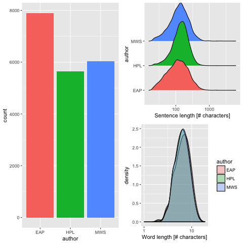
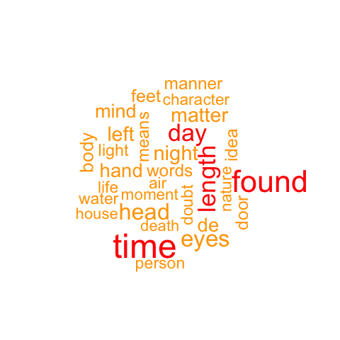
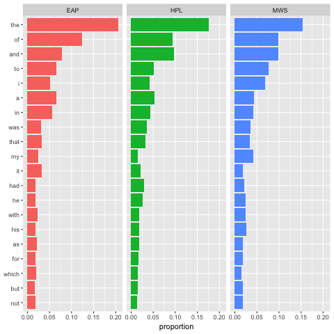
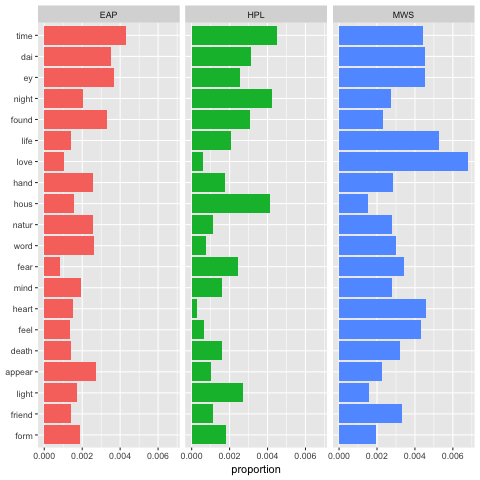
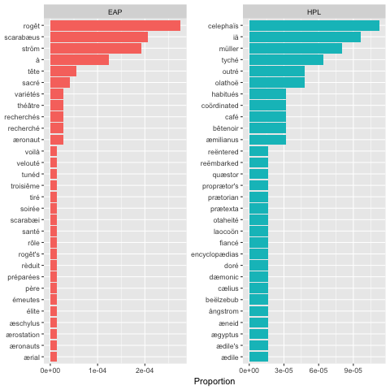
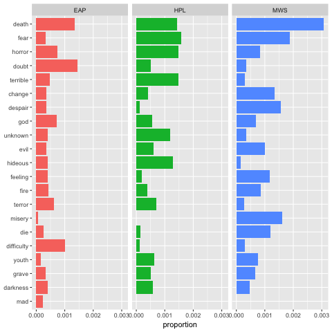

# Spring2018
# Project 1: Some Simple SPOOKY Data Analysis

----

### [Project Description](doc/)
This is the first and only *individual* (as opposed to *team*) this semester. 

Term: Spring 2018

+ Project title: The Similarities and Differences among Spooky Authors
+ This project is conducted by Pak Kin Lai, pl2599
+ Project summary: This project's purpose is to use various techniques to study the similarities and the differences in writing among three horror story authors, Edgar Allan Poe, HP Lovecraft, and Mary Shelley. This project's analysis is split into 3 major sections: Sentence and Structure Analyses, Characteristic Word Analyses, Pair Analyses, and Sentiment Analyses.

Following [suggestions](http://nicercode.github.io/blog/2013-04-05-projects/) by [RICH FITZJOHN](http://nicercode.github.io/about/#Team) (@richfitz). This folder is organized as follows.

```
proj/
??? lib/
??? data/
??? doc/
??? figs/
??? output/
```

Please see each subfolder for a README file.

# 5 Sentence and Structure Analyses
This section allows us to look at the general structure of the sentences for each author. 

## 5.1 Total Featured, Sentence Length, Word Length


Observations:

1. EAP is featured most frequently.
2. Sentence length varies more for EAP.
3. EAP has slightly longer words than the others, whereas MWS has slightly shorter words than the others. 

# 6 Characteristic Word Analyses

This section is to study the most frequently used characteristic word for each author. 

## 6.1 Original Dataset

This is the analyis done on our original dataset with the lower case and without punctuation.

### 6.1.i Proportion of Words

We first look at the highest proportion of the characteristic words used by each author.


Observations:

1. 'Time' is used commonly by all three authors.
2. 'Night' is used more frequently by HPL.
3. 'Life', 'heart', 'eyes', 'day', 'death', and 'love' are used much more frequently by MWS. HPL seldom uses the word 'love'.
4. 'Heard', 'house', annd 'door' are used more frequently by HPL.
5. 'Head' is used frequently by EAP.

## 6.1.ii Word Clouds

Word Clouds may also give us an interesting illustration. 

EAP


HPL


MWS


Observations:

1. 'Time' and 'Found' are very common words among the three authors.
2. EAP prefers the word 'Day', whereas HPL prefers the word 'Night'.
3. 'Love', 'Heart', 'Life' are common words for MWS.

### 6.1.i Tf-idf
  
A Tf-idf analysis will give us a measure of the frequency of a word used by one author relative to the frequency of that word used by the others. In other words, it adjusts for the rarity of the word. 


Observations:

1. As we expect, names such as 'Dupin', 'Gilman', 'Perdita' are the words with the highest tf-idf.
2. EAP's 'Monsieur' has a high tf-idf. However, she has the least amount of words in the top 30 tf-idfs shown above.
3. HPL's 'folk', 'bearded', 'reef', 'brown', and 'attic' are interesting words with high tf-idf.
4. MWS's 'misery', 'feelings', labours', and 'protector' are words with high tf-idf. They are words most associated with emotions and protections. MWS also has the most amount of words in the top 30 tf-idfs. 

### 6.2 Stop Words Dataset

This is the analysis done on the stop dataset that we created earlier.

### 6.2.i Proportion of Words

Using the dataset that includes the stop words, we can simply look at the most commonly used word grouped by each author since stop words are typically the most commonly used words. However, we look at the proportion instead of the total number of appearances since our earlier observation shows that authors are featured differently in this data. 


Observations:

1. EAP uses the words 'the', 'of', 'a', 'in'  much more frequently than the other two authors, and "and' much less frequently than the others.
2. EAP uses the word 'of' much more frequently than he uses 'and', whereas for the other two authors, the frequency of these two words are around the same.
3. HPL uses 'had' more frequently than the other two authors, but only by a small margin.
4. MWP uses the words "I", 'my', 'his' more frequently than the other two authors, but only by a small margin. 
5. HPL uses 'my' less frequently than the other two authors, but only by a small margin.

## 6.3 Stem Words Dataset

It might be interesting to see the words grouped by their stem instead. To do this, I duplicated the dataset and did the same analyses as above. 

### 6.3.i Proportion of Words


Observations:

1. 'Dai', 'ey', 'heart', 'feel', and 'death' are used more frequently by MWS.
2. 'Love' is used significantly more frequently by MWS.
3. 'Natur', 'word', and 'appear' is used by EAP more frequently.
4. 'Night' and 'hous' is used much more frequently by HPL.
5. 'Fear' is used less frequently compared to the other authors.

## 6.4 Accented Words Dataset

### 6.4.i Proportion of Words

Another interesting analysis to make is to look at the frequency/proportion of accented words for each author. 


Observations:

1. We see that only EAP and HPL uses these accented words. 
<<<<<<< HEAD
2. EAP uses the word 'rogeêt' a lot. 
3. HPL uses the word 'celephaiïs a lot. 
=======
2. EAP uses the word 'rogeêt' a lot. 
3. HPL uses the word 'celephaiïs a lot. 
>>>>>>> d4940e1393d73098306a2ce9f0de2dd4ebe45f3a

### 6.4.ii Proportion of All Words

However, there isn't many overlap of the specific accented words used between the two authors. As a result, it may be more useful to just simply see the proportion of all accented words used by each author.


Observations:

1. As we can see, EAP has more than double the proportion of accented words compared to that of HPL. 
2. MWS doesn't use accented words at all.

# 7 Pair Analyses

Now we might want to move on from looking at single words to two words.

## 7.1 Bigram Dataset

Bigram analysis allows us to observe two consecutive words.

### 7.1.i Frequency of Bigrams

We create another dataset using the `unnest_tokens()` function but this time to include two words at a time. 

We create an increasing ordered bar graph to show the most frequently used bigrams, colored by the author. 


Observations:

1. MWS' 'Lord Raymond' is the most commonly used bigram among all three authors. 'Ha ha' is used most commonly by EAP. 'Heh heh' is used most frequently by HPL.
2. Among the top 30 bigrams, EAP holds the majority of them, whereas MWS holds the least.

### 7.1.ii Tf_idf 

Just for fault-proof, a Tf_idf analysis is also done to look at the top 30 rarest bigrams among the three authors.


Observations:

1. Some special bigrams for EAP I observe are 'main compartment', 'chess player', 'death's head', and 'rowdy row'.
2. HPL's 'Shunned house', 'tempest mountain', and 'yog sothoth' are also some unique combinations. 
3. MWS's 'fellow creatures', 'native country', and 'natural philosophy' are quite frequent occurences.

## 7.2 Word Pairs Dataset

Now we want to analyze any pair of words that might show up in each text. This is separate from our bigram analysis because the pairs are irrespective of their adjacency, as long as they exist in the same text/passage.

## 7.2.i Frequency of Word Pairs


Observations:

1. EAP's most common pair is 'lalande madame'. Interestingly, 'Chess player' is also a pretty common pair.
2. HPL's most common pair is 'space time', also followed by 'day night'. A lot of the pairs also include words such as 'house', 'door', street'. 
3. MWS' most common pair is 'eyes tear'. A lot of her pairs include words such as 'love' and 'eyes'. 
4. All three authors have 'day night' in their top pairs. EAP and HPL as their 2nd highest, and MWS as ranked 6th. However it is important to note that the frequency of MWS' pairs are higher than the other two authors. Therefore, she actually uses 'day night' the most. 

# 8 Sentiment Analysis

Last but not least, we may want to look at some sentiment analysis to see what kind of emotions are the authors trying to evoke out of the readers.

## 8.1 Sentiment Words across Authors


Observations:

1. EAP does not use many words with fear and disgust, compared to the other authors. 
2. EAP has the highest proportion of trust
3. HPL is the only author with more negative words than positive words.
4. HPL has the smallest proportion of joy and surprise.
5. MWS has the highest proportion of positive words, as well as negative words and anticipation. 
6. MWS has the highest proportion of words associated with sentiment. 

## 8.2 Fear Dataset

Since we are analyzing horror texts, I thought that looking at the fear sentiment might yield some interest results.


Observations:

1. 'Death' is the most frequent fear word, and MWS has the largest proportion of that word used among all words in MWS text.
2. EAP has the smallest proportion of the word 'fear'. EAP has the largest proportion of 'doubt'
3. 'Terrible' is a popular word for HPL texts, and less for the other two authors.
4. 'Misery' is a word that is used often by MWS, used drastically less by EAP, and not used at all by HPL. 
5. 'Horror' is a relatively common word among all three authors. 
